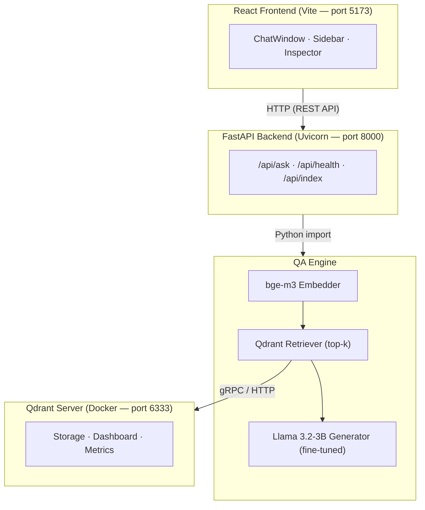

<div align="center">

# 🤖 TechQA — Transformer-based Question Answering System

[](https://www.python.org/)
[](https://react.dev/)
[](https://fastapi.tiangolo.com/)
[](https://qdrant.tech/)
[](https://www.langchain.com/)
[](LICENSE)

[](https://huggingface.co/BAAI/bge-m3)
[](https://huggingface.co/unsloth/Llama-3.2-3B-Instruct-bnb-4bit)
[](https://huggingface.co/datasets/PrimeQA/TechQA)
[](https://arxiv.org/abs/2405.06211)

<br/>

**A RAG-powered Question Answering system that combines fine-tuned Llama 3.2 with bge-m3 embeddings and Qdrant vector search to answer technical support questions.**

*Statistical Learning Course Project — University of Science (HCMUS)*

---

</div>

## 📋 Table of Contents

- [Overview](#-overview)
- [Architecture](#️-architecture)
- [Tech Stack](#️-tech-stack)
- [Project Structure](#-project-structure)
- [Getting Started](#-getting-started)
- [Usage](#-usage)
- [Training & Fine-tuning](#-training--fine-tuning)
- [Evaluation Results](#-evaluation-results)
- [References](#-references)
- [License](#-license)

---

## 🔍 Overview

This project implements a **Retrieval-Augmented Generation (RAG)** pipeline for answering technical support questions from the [TechQA](https://huggingface.co/datasets/PrimeQA/TechQA) dataset — a real-world QA benchmark curated from IBM technical support forums.

### How it works

1. **Index** — Technical documents are chunked, embedded using [bge-m3](https://huggingface.co/BAAI/bge-m3), and stored in [Qdrant](https://qdrant.tech/) vector database
2. **Retrieve** — When a user asks a question, the system finds the most relevant documents using dense vector similarity search
3. **Generate** — The retrieved context is combined with the question and fed into a [fine-tuned Llama 3.2-3B](https://huggingface.co/unsloth/Llama-3.2-3B-Instruct-bnb-4bit) model to generate a precise answer

### Key Features

- 🧠 **RAG Pipeline** — Retrieval-Augmented Generation for accurate, grounded answers
- 🔥 **Fine-tuned LLM** — Llama 3.2-3B fine-tuned on TechQA with QLoRA via [Unsloth](https://github.com/unslothai/unsloth)
- 🌍 **Multi-lingual Embeddings** — bge-m3 supporting dense, sparse, and ColBERT retrieval
- 📊 **Visual Dashboard** — Qdrant Web UI for monitoring indexed documents and search performance
- ⚡ **Modern Stack** — React frontend + FastAPI backend + Qdrant vector DB
- 🔍 **Document Inspector** — View retrieved source documents with similarity scores

---

## 🏗️ Architecture



---

## 🛠️ Tech Stack

| Component | Technology | Purpose |
|:---|:---|:---|
| **Embedding Model** | [BAAI/bge-m3](https://huggingface.co/BAAI/bge-m3) | Document & query embedding (1024-dim, multi-lingual) |
| **LLM** | [Llama 3.2-3B-Instruct](https://huggingface.co/unsloth/Llama-3.2-3B-Instruct-bnb-4bit) | Answer generation (4-bit quantized) |
| **Fine-tuning** | [Unsloth](https://github.com/unslothai/unsloth) + QLoRA | Efficient LLM fine-tuning (2-5x speedup, lower VRAM) |
| **Vector Database** | [Qdrant](https://qdrant.tech/) | Document storage, retrieval & built-in dashboard |
| **Backend** | [FastAPI](https://fastapi.tiangolo.com/) | Async REST API server with auto-generated docs |
| **Frontend** | [React](https://react.dev/) (Vite) | Modern, component-based chat UI |
| **Orchestration** | [LangChain](https://www.langchain.com/) | RAG pipeline management |
| **Dataset** | [PrimeQA/TechQA](https://huggingface.co/datasets/PrimeQA/TechQA) | IBM Technical Support QA (~800 pairs + 801K technotes) |

---

## 📂 Project Structure

```
qa_nlp_project/
│
├── 📄 README.md                        # You are here
├── 📄 .env.example                     # Environment variables template
├── 📄 docker-compose.yml               # Qdrant Docker setup
│
├── 📁 engine/                          # 🧠 Core AI Logic
│   ├── config.py                       #    Engine configuration
│   ├── pipeline.py                     #    RAG pipeline orchestrator
│   ├── embeddings/
│   │   └── bge_m3.py                   #    bge-m3 embedding wrapper
│   ├── retriever/
│   │   ├── vector_store.py             #    Qdrant operations
│   │   └── indexer.py                  #    Document indexing pipeline
│   ├── generator/
│   │   └── llm.py                      #    Fine-tuned Llama wrapper
│   └── data/
│       ├── loader.py                   #    TechQA dataset loader
│       └── preprocessor.py            #    Text chunking & cleaning
│
├── 📁 backend/                         # 🖥️ FastAPI Server
│   ├── main.py                         #    App entry point
│   ├── api/
│   │   ├── routes.py                   #    API endpoints
│   │   └── schemas.py                  #    Pydantic models
│   └── services/
│       └── qa_service.py               #    Business logic layer
│
├── 📁 frontend/                        # 🎨 React (Vite)
│   ├── src/
│   │   ├── App.jsx                     #    Main app component
│   │   ├── api/
│   │   │   └── qaClient.js             #    Backend API client
│   │   ├── components/
│   │   │   ├── ChatWindow.jsx          #    Chat messages display
│   │   │   ├── ChatInput.jsx           #    User input box
│   │   │   ├── Sidebar.jsx             #    Settings panel
│   │   │   ├── DocumentInspector.jsx   #    Retrieved docs viewer
│   │   │   └── Header.jsx              #    App header
│   │   └── hooks/
│   │       └── useChat.js              #    Chat state management
│   └── package.json
│
├── 📁 notebooks/                       # 📓 Jupyter Notebooks (Colab)
│   ├── 01_data_exploration.ipynb       #    Explore TechQA dataset
│   ├── 02_finetune_llama.ipynb         #    Fine-tune Llama 3.2
│   ├── 03_evaluate_model.ipynb         #    Model evaluation
│   └── 04_rag_experiments.ipynb        #    RAG pipeline experiments
│
├── 📁 docs/                            # 📖 Documentation
├── 📁 references/                      # 📚 Papers & requirements
├── 📁 data/                            # 💾 Data storage (gitignored)
├── 📁 models/                          # 🏋️ Model weights (gitignored)
└── 📁 tests/                           # 🧪 Unit & integration tests
```

---

## 🚀 Getting Started

### Prerequisites

| Requirement | Version | Purpose |
|:---|:---|:---|
| Python | 3.10+ | Backend & engine |
| Node.js | 18+ | React frontend |
| Docker | Latest | Qdrant server (recommended) |
| CUDA GPU | — | Model inference (or use Colab) |

### 1. Clone the repository

```bash
git clone https://github.com/MinhHCMUSsv/qa_nlp_project.git
cd qa_nlp_project
```

### 2. Set up environment variables

```bash
cp .env.example .env
# Edit .env with your configuration (HuggingFace token, etc.)
```

### 3. Start Qdrant (Vector Database)

```bash
# Option A: Docker (recommended — includes web dashboard)
docker-compose up -d

# Dashboard available at: http://localhost:6333/dashboard
```

```python
# Option B: Embedded mode (no Docker required, no dashboard)
# The engine will auto-create a local Qdrant instance at ./data/qdrant_db/
```

### 4. Install Backend & Engine

```bash
python -m venv .venv

# Windows
.venv\Scripts\activate
# macOS/Linux
source .venv/bin/activate

pip install -r engine/requirements.txt
pip install -r backend/requirements.txt
```

### 5. Install Frontend

```bash
cd frontend
npm install
cd ..
```

### 6. Run the application

```bash
# Terminal 1 — Backend
uvicorn backend.main:app --reload --port 8000

# Terminal 2 — Frontend
cd frontend
npm run dev
```

| Service | URL |
|:---|:---|
| 🎨 Frontend | http://localhost:5173 |
| 🖥️ Backend API | http://localhost:8000 |
| 📖 API Docs | http://localhost:8000/docs |
| 📊 Qdrant Dashboard | http://localhost:6333/dashboard |

---

## 💡 Usage

> 🚧 **Coming soon** — Screenshots and demo GIFs will be added once the UI is implemented.

1. Open the frontend at `http://localhost:5173`
2. Type a technical question in the chat input
3. The system retrieves relevant documents and generates an answer
4. Click on source documents to inspect retrieved context

---

## 🧪 Training & Fine-tuning

All training is designed to run on **Google Colab** (free T4 GPU).

| Notebook | Description |
|:---|:---|
| [`01_data_exploration.ipynb`](notebooks/01_data_exploration.ipynb) | Explore TechQA dataset structure, statistics, and samples |
| [`02_finetune_llama.ipynb`](notebooks/02_finetune_llama.ipynb) | Fine-tune Llama 3.2-3B on TechQA using Unsloth + QLoRA |
| [`03_evaluate_model.ipynb`](notebooks/03_evaluate_model.ipynb) | Evaluate model with BLEU, ROUGE, F1, and Exact Match |
| [`04_rag_experiments.ipynb`](notebooks/04_rag_experiments.ipynb) | End-to-end RAG pipeline experiments and ablations |

---

## 📊 Evaluation Results

> 🚧 **Coming soon** — Results will be populated after fine-tuning and evaluation.

| Metric | Base Model | Fine-tuned | Fine-tuned + RAG |
|:---|:---:|:---:|:---:|
| Exact Match (EM) | — | — | — |
| F1 Score | — | — | — |
| BLEU | — | — | — |
| ROUGE-L | — | — | — |

---

## 📚 References

### Papers

| # | Title | Authors | Year | Link | Role in Project |
|:---|:---|:---|:---:|:---:|:---|
| 1 | A Survey on RAG Meets LLMs: Towards Retrieval-Augmented Large Language Models | Yujuan Ding et al. | 2024 | [ArXiv](https://arxiv.org/abs/2405.06211) | Primary reference — RAG + LLMs survey |
| 2 | Retrieval-Augmented Generation for Knowledge-Intensive NLP Tasks | Lewis et al. | 2020 | [ArXiv](https://arxiv.org/abs/2005.11401) | RAG foundational paper |
| 3 | BGE M3-Embedding: Multi-Lingual, Multi-Functionality, Multi-Granularity Text Embeddings | Chen et al. | 2024 | [ArXiv](https://arxiv.org/abs/2402.03216) | Embedding model paper |
| 4 | TechQA: A Real-World Benchmark for AI Question Answering Using IBM Technotes | Castelli et al. | 2020 | [ArXiv](https://arxiv.org/abs/1911.02984) | Dataset paper |

### Datasets

| Dataset | Description | Size | Link |
|:---|:---|:---|:---|
| PrimeQA/TechQA | IBM Technical Support QA — real-world technical questions | ~800 QA pairs + 801K technotes | [HuggingFace](https://huggingface.co/datasets/PrimeQA/TechQA) |

### Models

| Model | Description | Parameters | Link |
|:---|:---|:---|:---|
| BAAI/bge-m3 | Multi-lingual, multi-granularity embedding model | 568M | [HuggingFace](https://huggingface.co/BAAI/bge-m3) |
| Llama 3.2-3B-Instruct (4-bit) | Meta LLM, quantized via Unsloth/bitsandbytes | ~1.5GB (4-bit) | [HuggingFace](https://huggingface.co/unsloth/Llama-3.2-3B-Instruct-bnb-4bit) |

### Code References

| Repository | Description | Link |
|:---|:---|:---|
| rag-bot-fastapi | RAG chatbot template (FastAPI + Streamlit) — architecture reference | [GitHub](https://github.com/Zlash65/rag-bot-fastapi) |
| Mattpocock Skills | Gemini CLI agent skills template | [GitHub](https://github.com/mattpocock/skills) |
| Unsloth | LLM fine-tuning acceleration library | [GitHub](https://github.com/unslothai/unsloth) |

### Tools & Libraries

| Library | Purpose | Link |
|:---|:---|:---|
| FastAPI | Backend REST API framework | [Docs](https://fastapi.tiangolo.com/) |
| React (Vite) | Frontend UI framework | [Docs](https://vitejs.dev/) |
| LangChain | LLM orchestration & RAG pipeline | [Docs](https://www.langchain.com/) |
| Qdrant | Vector database with web dashboard | [Docs](https://qdrant.tech/) |
| HuggingFace Transformers | Model loading & inference | [Docs](https://huggingface.co/docs/transformers) |
| Sentence-Transformers | Embedding model wrapper | [Docs](https://sbert.net/) |
| Unsloth | Fine-tuning acceleration (2-5x speedup) | [GitHub](https://github.com/unslothai/unsloth) |

---

## 📜 License

This project is licensed under the [MIT License](LICENSE).

---

<div align="center">

**Built with ❤️ for Statistical Learning Course @ HCMUS**

[](https://www.python.org/)
[](https://react.dev/)
[](https://huggingface.co/)

</div>