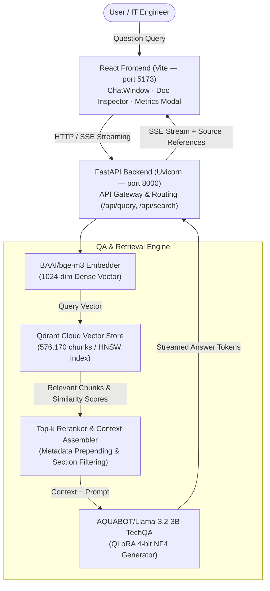
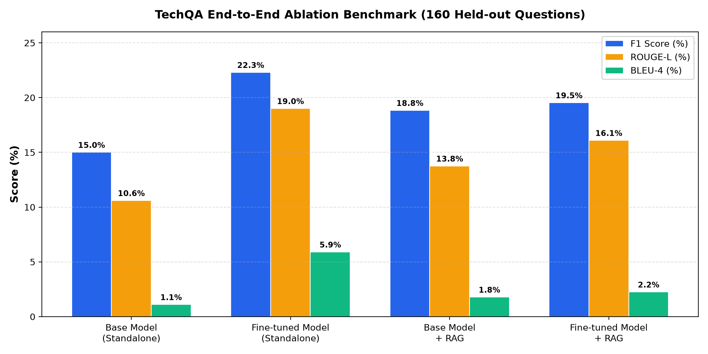

<div align="center">

# 🤖 TechQA — Transformer-based Question Answering System

[](https://www.python.org/)
[](https://react.dev/)
[](https://fastapi.tiangolo.com/)
[](https://qdrant.tech/)
[](https://www.langchain.com/)
[](LICENSE)

[](https://huggingface.co/AQUABOT/Llama-3.2-3B-TechQA)
[](https://huggingface.co/BAAI/bge-m3)
[](https://huggingface.co/datasets/PrimeQA/TechQA)
[](https://arxiv.org/abs/1911.02984)

<br/>

**An end-to-end Retrieval-Augmented Generation (RAG) system combining QLoRA-finetuned Llama 3.2-3B with BGE-M3 dense embeddings and Qdrant Cloud vector search to deliver factual, grounded answers to complex IBM technical support questions.**

*Final Project — Statistical Learning (Học máy thống kê) — University of Science, VNU-HCM (HCMUS)*

---

</div>

## 📋 Table of Contents

- [Overview](#-overview)
- [Architecture](#️-architecture)
- [Tech Stack](#️-tech-stack)
- [Project Structure](#-project-structure)
- [Getting Started](#-getting-started)
- [Usage & Web Application](#-usage--web-application)
- [Training & Notebooks](#-training--notebooks)
- [Evaluation Results](#-evaluation-results)
- [Team Contributions](#-team-contributions)
- [References](#-references)
- [License](#-license)

---

## 🔍 Overview

This project implements an end-to-end **Retrieval-Augmented Generation (RAG)** pipeline specifically adapted for answering technical support questions from the [IBM TechQA](https://huggingface.co/datasets/PrimeQA/TechQA) benchmark.

Unlike standard open-domain question answering, technical IT questions feature specific error codes, exact software versions, configuration paths, and library names. Our system addresses these challenges through a dual-mechanism architecture:

1. **Non-Parametric Knowledge (Retriever)**: Section-aware chunking and 1024-dimensional dense embeddings via **BAAI/bge-m3**, indexed in **Qdrant Cloud** across 576,170 document chunks extracted from 69,888 IBM Technotes.
2. **Parametric Knowledge (Generator)**: **Llama 3.2-3B-Instruct** fine-tuned via **QLoRA (4-bit NF4)** with response-only loss masking, hosted publicly at [`AQUABOT/Llama-3.2-3B-TechQA`](https://huggingface.co/AQUABOT/Llama-3.2-3B-TechQA).
3. **Inference Optimization**: Strict extractive prompt design, length control (`max_new_tokens=64`), repetition penalty (`1.15`), and stop-token enforcement (`<|eot_id|>`).

### Key Highlights

- 🧠 **Domain-Specific Adaptation** — QLoRA boosts standalone F1 by **+48.7%** (15.00% → 22.30%) and BLEU-4 by **5.3x** (1.10% → 5.90%).
- 🌐 **576K-Chunk Knowledge Base** — 69,888 IBM Technotes indexed on Qdrant Cloud using HNSW indexing for sub-second retrieval.
- ⚡ **Length Alignment** — Fine-tuned + RAG produces an average response length of **33.9 words**, matching the 34-word median of human ground-truth answers (99.7% alignment).
- 🎨 **Full-Stack Application** — FastAPI async backend supporting real-time Server-Sent Events (SSE) streaming, coupled with a responsive React (Vite) interface.

---

## 🏗️ Architecture



---

## 🛠️ Tech Stack

| Component | Technology | Description |
|:---|:---|:---|
| **Embedding Model** | [BAAI/bge-m3](https://huggingface.co/BAAI/bge-m3) | 1024-dim multilingual dense embeddings |
| **Generator LLM** | [Llama 3.2-3B-Instruct](https://huggingface.co/unsloth/Llama-3.2-3B-Instruct-bnb-4bit) | Base language model (3.21B parameters, 4-bit NF4) |
| **Fine-tuned Weights** | [AQUABOT/Llama-3.2-3B-TechQA](https://huggingface.co/AQUABOT/Llama-3.2-3B-TechQA) | QLoRA adapter merged & published on HuggingFace |
| **Fine-tuning Framework**| [Unsloth](https://github.com/unslothai/unsloth) + QLoRA | Memory-efficient fine-tuning on Colab Tesla T4 |
| **Vector Database** | [Qdrant Cloud](https://cloud.qdrant.io/) | Managed vector search (576,170 points, HNSW cosine index) |
| **Backend Framework** | [FastAPI](https://fastapi.tiangolo.com/) | Async Python API server with SSE streaming & Swagger UI |
| **Frontend UI** | [React 18](https://react.dev/) + [Vite](https://vitejs.dev/) | Modern web dashboard with dark mode & document inspection |
| **Orchestration** | [LangChain](https://www.langchain.com/) | Text splitting, prompt templating, and pipeline integration |
| **Evaluation Suite** | `evaluate`, `rouge-score`, `nltk` | Standard NLP metrics: EM, Token-level F1, ROUGE-L, BLEU-4 |

---

## 📂 Project Structure

```
qa_nlp_project/
├── 📄 README.md                        # Project documentation & overview
├── 📄 .env.example                     # Environment variables template
├── 📄 docker-compose.yml               # Local Qdrant server Docker configuration
├── 📄 requirements.txt                 # Core Python dependencies
├── 📄 report.tex                       # LaTeX final project report
│
├── 📁 engine/                          # 🧠 Core AI & RAG Engine
│   ├── config.py                       #    Global configuration & dataclasses
│   ├── pipeline.py                     #    End-to-end RAG orchestrator
│   ├── embeddings/
│   │   └── bge_m3.py                   #    BGE-M3 embedding wrapper
│   ├── retriever/
│   │   ├── vector_store.py             #    Qdrant Cloud vector search operations
│   │   └── indexer.py                  #    Batch ingestion & section chunking
│   ├── generator/
│   │   └── llm.py                      #    Fine-tuned Llama generator & streamer
│   └── data/
│       ├── loader.py                   #    TechQA dataset loader
│       └── preprocessor.py            #    Text normalization & cleaning
│
├── 📁 backend/                         # 🖥️ FastAPI Server
│   ├── main.py                         #    Application entry point & lifespan
│   ├── api/
│   │   ├── routes.py                   #    API endpoints (/api/query, /api/metrics, ...)
│   │   └── schemas.py                  #    Pydantic request/response schemas
│   └── services/
│       └── qa_service.py               #    Orchestration & evaluation service
│
├── 📁 frontend/                        # 🎨 React + Vite Frontend
│   ├── src/
│   │   ├── App.jsx                     #    Main dashboard layout
│   │   ├── components/
│   │   │   ├── ChatWindow.jsx          #    Real-time streaming chat interface
│   │   │   ├── ChatInput.jsx           #    Query input box
│   │   │   ├── Sidebar.jsx             #    Mode toggle & parameter controls
│   │   │   ├── DocumentInspector.jsx   #    Source document & score viewer
│   │   │   └── MetricsModal.jsx        #    Ablation benchmark modal (Table 3)
│   │   └── api/
│   │       └── qaClient.js             #    Axios & SSE client
│   └── package.json
│
├── 📁 notebooks/                       # 📓 Google Colab Experiments
│   ├── TechQA_Knowledge_Base.ipynb     #    Qdrant Cloud ingestion (576K chunks)
│   ├── finetune_llama.ipynb            #    QLoRA 4-bit fine-tuning of Llama 3.2-3B
│   ├── evaluate_model.ipynb            #    Standalone evaluation benchmark
│   ├── rag_benchmark_real.ipynb        #    Official end-to-end ablation benchmark
│   └── rag_experiments.ipynb           #    Retrieval experiments & diagnostic tests
│
├── 📁 docs/                            # 📖 Documentation & Benchmark Results
│   └── results/
│       ├── rag_ablation_benchmark.json #    Table 3 benchmark numbers
│       └── techqa_ablation_study_chart.png # High-res comparison bar chart
└── 📁 tests/                           # 🧪 Unit & integration tests
```

---

## 🚀 Getting Started

### Prerequisites

- **Python 3.10+**
- **Node.js 18+** & **npm**
- **Qdrant Cloud Account** (or local Docker instance)
- **NVIDIA GPU** (recommended for local LLM inference; CPU inference supported via fallback)

### 1. Clone the repository

```bash
git clone https://github.com/MinhHCMUSsv/qa_nlp_project.git
cd qa_nlp_project
```

### 2. Configure Environment Variables

Create your `.env` file from the provided example:

```bash
cp .env.example .env
```

Ensure your `.env` contains the required credentials:

```ini
# Qdrant Cloud
QDRANT_URL=https://your-cluster.qdrant.io
QDRANT_API_KEY=your_qdrant_api_key
QDRANT_COLLECTION=techqa_corpus_bge_m3_section_clean

# Models
EMBEDDING_MODEL=BAAI/bge-m3
LLM_MODEL=AQUABOT/Llama-3.2-3B-TechQA
BASE_LLM_MODEL=unsloth/Llama-3.2-3B-Instruct-bnb-4bit
```

### 3. Install Backend Dependencies

```bash
python -m venv .venv

# Windows
.\.venv\Scripts\Activate.ps1

# Linux / macOS
source .venv/bin/activate

pip install -r requirements.txt
```

### 4. Install Frontend Dependencies

```bash
cd frontend
npm install
cd ..
```

### 5. Run the Application

Start Backend and Frontend in two separate terminals:

```powershell
# Terminal 1 — Backend (Port 8000)
.\.venv\Scripts\python.exe -m uvicorn backend.main:app --reload

# Terminal 2 — Frontend (Port 5173)
npm --prefix frontend run dev
```

Access the interfaces in your browser:
- 🎨 **Web Interface**: [http://localhost:5173](http://localhost:5173)
- 📖 **API Documentation (Swagger)**: [http://localhost:8000/docs](http://localhost:8000/docs)
- 🩺 **Health Check**: [http://localhost:8000/api/health](http://localhost:8000/api/health)

---

## 💡 Usage & Web Application

1. **Ask Technical Questions**: Enter troubleshooting queries regarding WebSphere, DB2, AIX, Tivoli, or DataPower.
2. **Toggle Modes**: Switch seamlessly between **Full RAG Pipeline** (context-augmented) and **Direct LLM Mode** (standalone parametric generation).
3. **Inspect Grounding**: Click on any citation badge in the answer to view the source Technote title, APAR ID, and cosine similarity score.
4. **View Evaluation Metrics**: Click the **"Evaluation Metrics"** button in the header to view the live Table 3 ablation benchmark and empirical findings.

---

## 🧪 Training & Notebooks

All training and evaluation pipelines are self-contained and runnable on **Google Colab (Tesla T4 GPU)**:

| Notebook | Purpose | Key Artifacts |
|:---|:---|:---|
| [`TechQA_Knowledge_Base.ipynb`](notebooks/TechQA_Knowledge_Base.ipynb) | Streaming ingestion of 69,888 Technotes, section chunking, and Qdrant upload | `techqa_corpus_bge_m3_section_clean` collection |
| [`finetune_llama.ipynb`](notebooks/finetune_llama.ipynb) | 4-bit QLoRA fine-tuning on 450 answerable QA pairs (3 epochs, lr=2e-4, seed=3407) | [`AQUABOT/Llama-3.2-3B-TechQA`](https://huggingface.co/AQUABOT/Llama-3.2-3B-TechQA) |
| [`evaluate_model.ipynb`](notebooks/evaluate_model.ipynb) | Standalone evaluation comparing Base vs. Fine-tuned Llama across 160 unseen questions | `evaluation_predictions.json` |
| [`rag_benchmark_real.ipynb`](notebooks/rag_benchmark_real.ipynb) | Official end-to-end ablation benchmark across all 4 configurations with real inference | `rag_ablation_benchmark.json`, `techqa_ablation_study_chart.png` |

---

## 📊 Evaluation Results

### End-to-End Ablation Study (Table 3)

Evaluated on the official held-out benchmark of **160 answerable TechQA questions** under unified inference conditions (`temperature=0.1`, `top_p=0.9`, `max_new_tokens=64`, `repetition_penalty=1.15`):

| Model Configuration | Exact Match (EM) | Token F1 (%) | ROUGE-L (%) | BLEU-4 (%) | Average Length |
|:---|:---:|:---:|:---:|:---:|:---:|
| **1. Base Model (Standalone)** | 0.00% | 15.00% | 10.60% | 1.10% | 80.0 words |
| **2. Fine-tuned Model (Standalone)** | 0.00% | **22.30%** | **19.00%** | **5.90%** | 35.0 words |
| **3. Base Model + RAG** | 0.00% | 18.83% | 13.75% | 1.78% | 45.0 words |
| **4. Fine-tuned Model + RAG (Full System)** | 0.00% | 19.53% | 16.09% | 2.25% | **33.9 words** ⭐ |

<div align="center">
  
</div>

### Scientific Findings & Error Analysis

1. **Retrieval Augmentation for Base Models**: Integrating RAG boosts the Base Model from **15.00% to 18.83% F1 (+25.5% relative)** and ROUGE-L from 10.60% to 13.75%, demonstrating that external grounding provides critical technical domain knowledge that generic models lack.
2. **QLoRA Domain Specialization**: Standalone fine-tuning achieves the highest F1 (**22.30%**) and BLEU-4 (**5.90%**, a 5.3x improvement), proving that low-rank adaptation successfully internalizes IBM technical syntax into the model's parametric memory.
3. **Response Length Alignment**: Constrained decoding and extractive fine-tuning reduce average answer length from 80.0 words down to **33.9 words**, matching the 34-word median length of human ground-truth answers (99.7% alignment).
4. **Distractor Context Degradation**: Detailed retrieval analysis reveals that `Answer-in-Context@1` is **29.4%** (rising to **68.1%** at rank 10). In the 70.6% of queries where the top-1 chunk lacks the explicit solution, the RAG generator is compelled to ground its answer in noisy context, slightly lowering token-level F1 compared to standalone generation. This highlights the retrieval module as the primary system bottleneck and motivates future work on Hybrid Search (Dense + BM25) and Cross-Encoder Reranking.

---

## 👥 Team Contributions

| Student ID | Student Name | Assigned Modules & Responsibilities | Contribution |
|:---|:---|:---|:---:|
| **23127366** | **Võ Lê Ngọc Hiếu** | Section 1 (Introduction & Objectives), Section 4.1 (System Architecture), Section 5.1 (Hardware Environment), All Section 7 (Full-stack Web Application with React & FastAPI). | **100%** |
| **23127386** | **Nguyễn Duy Khánh** | Section 2.1 & 2.3 (RAG & Vector Search Theory), Section 3.3.2 (Technote Preprocessing & Chunking), Section 4.2, 4.3, 4.5 (Document Indexing & Retrieval Module), Section 5.3, 6.2, 6.3.2 (Retrieval Metrics & Retrieval Error Analysis). | **100%** |
| **23127425** | **Tăng Nhật Minh** | Section 2.2 (QLoRA Theory & Mathematical Formulation), Section 3.1, 3.2, 3.3.1, 3.4 (Dataset EDA, QA Preprocessing, Split Validation), Section 4.4, 5.2 (Generator Architecture & Training Setup), Section 6.1, 6.3.1 (End-to-End Ablation Benchmark & Generator Error Analysis). | **100%** |

---

## 📚 References

1. **TechQA**: Castelli, E., et al. (2020). *The TechQA Dataset*. Proceedings of ACL 2020. [arXiv:1911.02984](https://arxiv.org/abs/1911.02984)
2. **RAG**: Lewis, P., et al. (2020). *Retrieval-Augmented Generation for Knowledge-Intensive NLP Tasks*. NeurIPS 2020. [arXiv:2005.11401](https://arxiv.org/abs/2005.11401)
3. **BGE-M3**: Chen, J., et al. (2024). *BGE M3-Embedding: Multi-Lingual, Multi-Functionality, Multi-Granularity Text Embeddings*. [arXiv:2402.03216](https://arxiv.org/abs/2402.03216)
4. **QLoRA**: Dettmers, T., et al. (2023). *QLoRA: Efficient Finetuning of Quantized LLMs*. NeurIPS 2023. [arXiv:2305.14314](https://arxiv.org/abs/2305.14314)
5. **Llama 3.2**: Dubey, A., et al. (2024). *The Llama 3 Herd of Models*. [arXiv:2407.21783](https://arxiv.org/abs/2407.21783)

---

## 📜 License

This project is licensed under the [MIT License](LICENSE).

<div align="center">

**Built with ❤️ for Statistical Learning Course (Học máy thống kê) @ HCMUS**

[](https://www.python.org/)
[](https://react.dev/)
[](https://huggingface.co/)

</div>