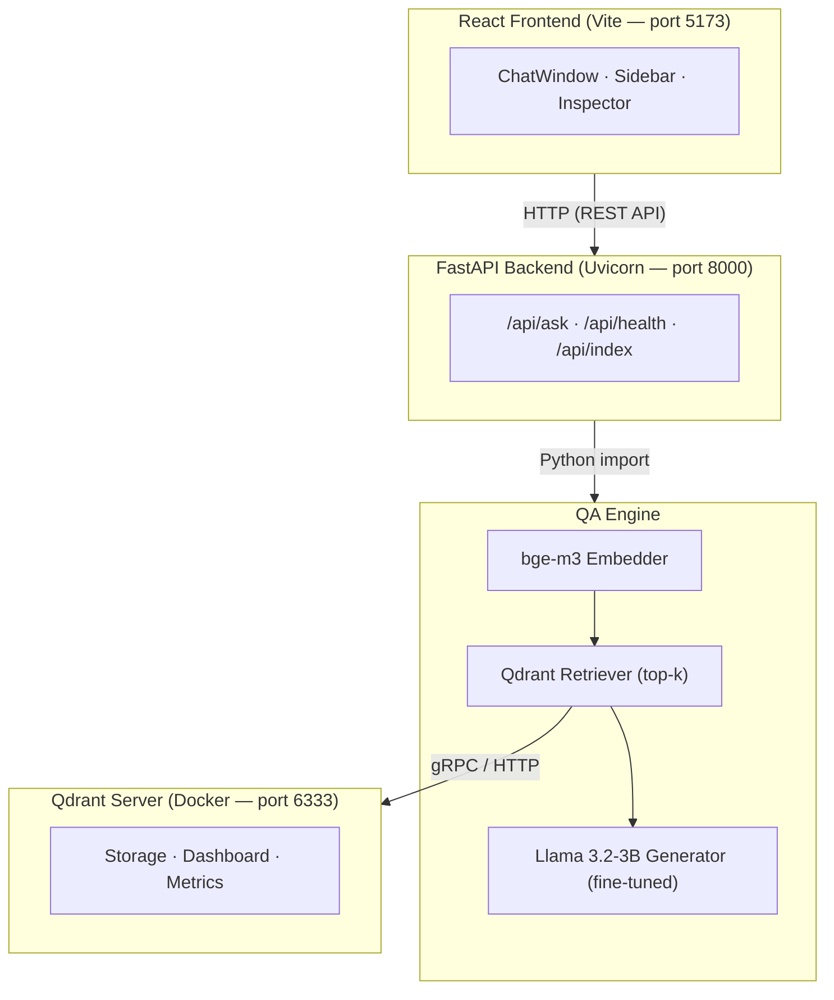

# Architecture Documentation

> Detailed architecture documentation will be added as the system is implemented.

## System Overview

The TechQA system follows a **3-layer architecture**:

1. **Engine** — Core AI logic (embedding, retrieval, generation)
2. **Backend** — FastAPI REST API server
3. **Frontend** — React (Vite) web interface

## Data Flow

